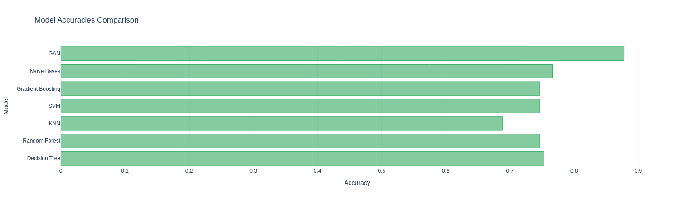

# Project Title

A brief description of what this project does and who it's for.

## Table of Contents

- [Installation](#installation)
- [Components](#Defining_GAN_components)
- [Taining GAN](#Training_Model)
- [Traing ANN model](#ANN-model)
- [Tuning of model](#CROSS_VALIDATION)
- [Comparison](#)
- [Conclusion](#)
## Installation

Instructions on how to install and set up the project.

```bash
pip install -r requirements.txt
```

## Defining GAN Components
>Generator Model

Defining the generator architecture for generating synthetic data

>Discriminator Model

Defining the Discriminator architecture for discriminating between real and fake data

## Training Model
>Combining Generator and Discriminator

- In build_gan function combine both the architecture i.e Generator and  Discriminator 

- Prepare the data for testing and training of the architecture

- After training the Architecture combine real data and fake data

## ANN_Model
>Training and Evaluation Steps

- **Data Preprocessing**: Normalize the input data and split it into training and testing sets.


- **Model Architecture**: Define the architecture of the Artificial Neural Network (ANN).
- **Compile Model**: Compile the model with appropriate loss function and optimizer.
- **Train Model**: Train the model using the training data.
- **Evaluate Model**: Evaluate the model using the testing data to determine its accuracy.
>Accuracy 

```python
y_pred=ann.predict(X_test)
y_pred_bin = (y_pred > 0.5).astype(int)
from sklearn.metrics import accuracy_score
acc=accuracy_score(y_test,y_pred_bin)
print(f"Test Accuracy: {acc:.2f}")
```
## CROSS VALIDATION
>K-FOLDS

Here we are using k-folds technique to implement the corss-validation technique

here we are dividing the data in 5 units with 8 fold each

>Accuracy after fine tunning
```python
acc_gan_cv = np.mean(cv_accuracies)
print(f'Accuracy after applying cross validation is {(acc_gan_cv):.2f}')
```
> Vaidation Accuracy Plot

 

## Comparison with other Models

>Different Models With their Accuracies

```python
Decision Tree Accuracy: 0.75
Random Forest Accuracy: 0.75
KNN Accuracy: 0.69
SVM Accuracy: 0.75
Gradient Boosting Accuracy: 0.75
Naive Bayes Accuracy: 0.77
```
>Comparing them with GAN Accuracy



## Conclusion

In conclusion, this project demonstrates the effectiveness of Generative Adversarial Networks (GANs) in generating synthetic data and the potential of combining GAN-generated data with traditional models like Artificial Neural Networks (ANNs) to improve performance. The cross-validation results and comparison with other models highlight the robustness and accuracy of the proposed approach. Future work could explore further tuning of the GAN and ANN models, as well as the application of this methodology to other datasets and domains.


This project is licensed under the MIT License - see the [LICENSE](LICENSE) file for details.